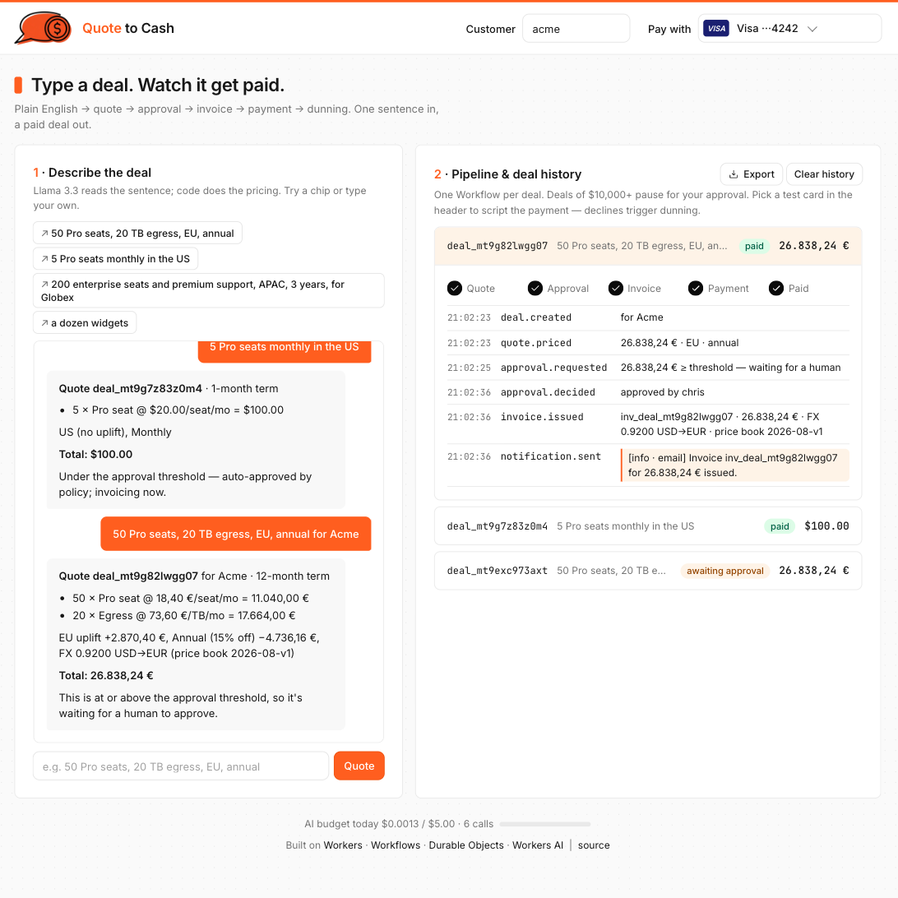

<p align="center"></p>

# Quote to Cash

**Type a deal in plain English. An agent plans it inside hard policy limits; Cloudflare Workflows carry it to paid.**

[](https://github.com/sivori/quote-to-cash/actions/workflows/ci.yml) &nbsp; **Live demo → [quote-to-cash.csivori.workers.dev](https://quote-to-cash.csivori.workers.dev)**

[](https://quote-to-cash.csivori.workers.dev)

## How it works

```
"200 enterprise seats, APAC, 3 years, for Globex"
        │
        ▼  parse      Llama 3.3 extracts products, quantities, region, term — never prices
        ▼  agent      Llama 3.3 runs a tool loop:  lookup_pricing → apply_discount → request_approval → choose_dunning_strategy → finalize
                      every tool is code behind a guardrail (policy.ts): it can ask, it cannot decide
        ▼  plan       quote in integer cents · discount (if policy allows) · approval? · dunning strategy · rationale · full tool trace
        ▼  CustomerAccount (Durable Object) records the deal and every tool call
        ▼  QuoteToCash (Workflow) — durable waits and scheduled retries only
           waitForEvent(approval) ─▶ invoice ─▶ charge ─▶ paid
                                                  │ declined
                                      notice · sleep · retry · notice · sleep · retry · … · collections   (schedule the agent chose)
```

| Cloudflare service | Used for |
|---|---|
| [Workers AI](https://developers.cloudflare.com/workers-ai/) | Llama 3.3: JSON-schema parsing, then a function-calling agent loop over the deal tools |
| [Workflows](https://developers.cloudflare.com/workflows/) | Durable execution of the plan: `waitForEvent` for approval, `sleep` for dunning backoff, idempotent steps |
| [Durable Objects](https://developers.cloudflare.com/durable-objects/) | Per-customer deal history, event log and chat memory; a singleton spend guard |
| [Workers](https://developers.cloudflare.com/workers/) + Static Assets | API and the UI |

## Try it in two minutes

1. Open the [demo](https://quote-to-cash.csivori.workers.dev) and click the chip **5 Pro seats monthly in the US**. It's under the approval threshold, so it auto-approves, invoices, and pays — expand the deal to see each step.
2. In the header, switch **Pay with** to *Mastercard ···0341* (declines twice), then click **200 enterprise seats and premium support, APAC, 3 years, for Globex**. Expand the deal: the agent's tool calls are in the timeline — it priced the deal, proposed a small multi-year discount (policy checked it), chose *gentle* dunning for a strategic account, and the $372k total forced human approval. Click **Approve**. Watch the decline, the notice, the retry, and the payment on attempt 3. Dunning days run at 5 s each in the demo.
3. Click **Export** for the deal history as CSV or PDF.

| Test card | Behaviour |
|---|---|
| Visa ···4242 | pays first time |
| Mastercard ···0341 | declines twice, pays on the third attempt |
| Amex ···9995 | insufficient funds until the fourth attempt |
| Discover ···0002 | `do_not_honor` — straight to collections |

## Design decisions

- **The agent proposes; policy decides.** The LLM's only powers are five tools ([`agent.ts`](src/agent.ts)). Each runs through [`policy.ts`](src/policy.ts) first: discounts need a reason and a discountable term, up to 10% alone, 10–25% only with a human, never more; approval can be escalated but never waived — deals at or above the threshold always wait; dunning is an id from an allowlist, never a schedule the model wrote. The loop is bounded (6 tool calls), tool arguments are coerced and validated, and a malformed or exhausted loop falls back to the plan policy alone would make. Every tool call and refusal is recorded on the deal.
- **The model names things; code prices them.** Llama 3.3 returns SKUs, quantities, region and term into a schema. `validate()` maps them onto the catalog and *reports* anything it can't, rather than guessing. Every amount, message, and policy decision comes from code. ([`parse.ts`](src/parse.ts), [`pricing.ts`](src/pricing.ts), [`catalog.ts`](src/catalog.ts))
- **Money is integers.** Cents, basis points, round-half-up. EU deals are priced in EUR at a price-book FX rate, and every quote and invoice is stamped with that rate and the price-book version, so an invoice still explains itself after the book changes.
- **Workflows do the durable part only.** The Workflow makes no decisions: it waits on `waitForEvent` when the plan says a human must approve, issues the one invoice, charges, and `sleep`s between retries on the schedule the agent chose. Instance id = deal id, so a resubmitted deal resumes rather than duplicates; one invoice and one decision per deal are enforced in the Durable Object; the event log is append-only. ([`pipeline.ts`](src/pipeline.ts), [`account.ts`](src/account.ts))
- **Dunning reads the processor's word.** `card_declined` retries with escalating notices on the strategy the agent picked (standard 1/3/7d, gentle 3/7/14d, aggressive 1/2/4d); `do_not_honor` goes straight to collections. Days are a deployment setting (`SECONDS_PER_DAY`), so the same code runs in seconds here and in days in production. ([`payments.ts`](src/payments.ts), [`policy.ts`](src/policy.ts))
- **A public demo needs a spend guard.** A singleton `Budget` Durable Object meters every LLM call from the model's reported usage at Workers AI's [published rates](https://developers.cloudflare.com/workers-ai/platform/pricing/): $5 per day overall, 150 quotes per IP per day, at most one every 400 ms. Past the cap a keyword parser takes over and the reply says so; the footer shows today's spend. ([`budget.ts`](src/budget.ts))

## Run it

```bash
npm install
npm test          # pricing, guardrails, parser validation, payments, dunning clock, exports, budget
npm run dev       # http://localhost:8787 — Workers AI runs remotely even in dev (wrangler login)
scripts/demo.sh   # two deals end to end against the dev server
npm run deploy
```

Settings are in [`wrangler.jsonc`](wrangler.jsonc): approval threshold, seconds per day, model, AI budget.

## Not in scope

Real payments (`charge()` has the shape a Stripe PaymentIntents call would replace), tax, and login. Each is a bounded addition; none changes the pipeline.

## How it was built

With Claude Code, prompt by prompt. Every prompt is in [`PROMPTS.md`](PROMPTS.md), verbatim and in order. The UX pass against Cloudflare's own design system is in [`docs/ux-review.md`](docs/ux-review.md).
